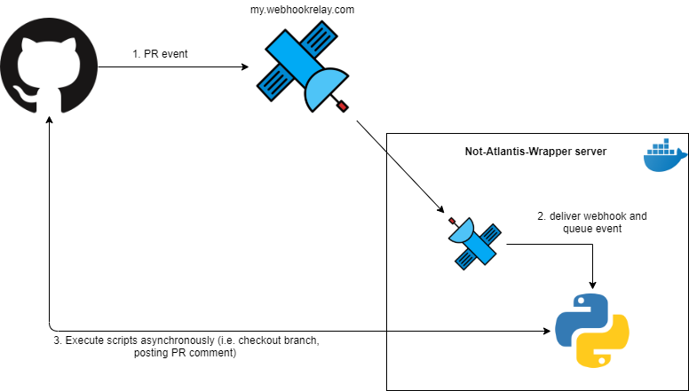
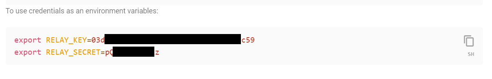
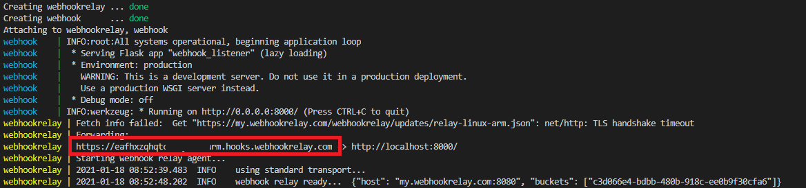
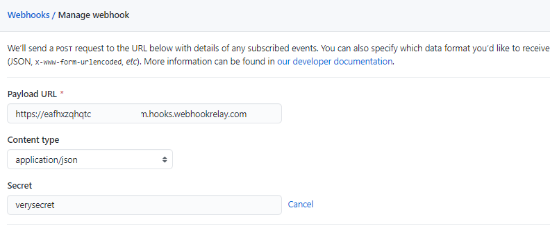
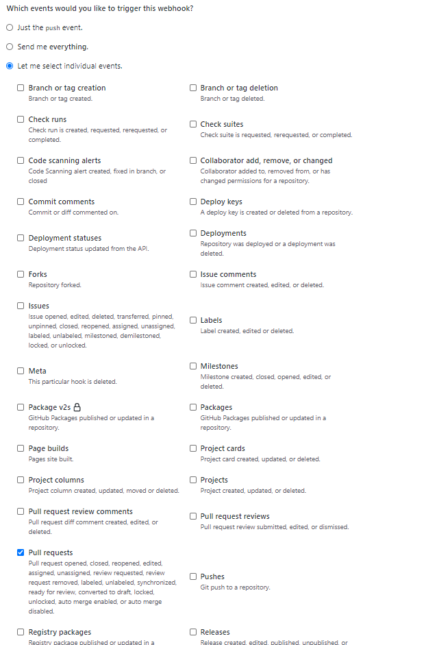
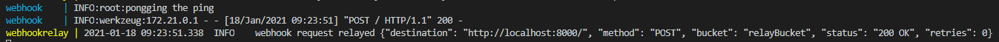
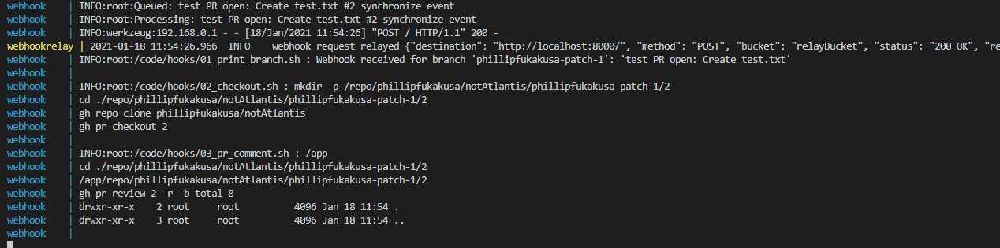

# Not-Atlantis-Wrapper (Docker)

A simple Flask python application based on [static-float/docker-webhook](https://github.com/staticfloat/docker-webhook) that queues [GitHub webhook](https://docs.github.com/en/developers/webhooks-and-events/webhooks) (pull request) events and runs scripts in response to them. Using the scripts located in `code\hooks\`, you can react to opened or synchronized pullrequest events where it will print out the current branch (01_print_branch.sh) check out your code for the HEAD of that PR (02_checkout.sh), and run `sleep 3 && ls -la` to simulate the task taking a bit of time and post the standard output as a PR comment (03_pr_comment). Update these scripts (or add new ones) as needed.

## Project Architecture


This project uses several tools and containers to respond to GitHub Webhooks:
* Not-Atlantis-Wrapper - a webhook listener that queues incoming PR opened and synchronized messages (can be customized) and processes them in a single thread
* relay - will allow us to receive webhooks anywhere without exposing them to the internet.
* ~~nginx - using a reverse proxy configuration will allow us to receive webhooks and redirect them to docker-webhook~~ (work in progress, pending exposing nginx to the internet)

## Requirements
This project relies on a container solution called [Docker](https://www.docker.com/get-started) and [Python3](https://www.python.org/ftp/python/3.9.1/python-3.9.1-amd64.exe) (if you're going webhook_listener to run locally)

## Setup
A `docker-compose.yml` file has been created to facilitate the configuration of this project. 

The webhook_listener container (aka webhook in the docker-compose file) relies on a [webhookrelay container](https://webhookrelay.com/v1/tutorials/forwarding-deep-dive.html) in order to be exposed to the internet from your local computer.

1. Creating and associating a WebhookRelay account
    * Create a webhookrelay account (https://my.webhookrelay.com/register). 
    * Verify your email
    * Create an access token (https://my.webhookrelay.com/tokens). Click on **+ CREATE TOKEN** and take note of the RELAY_KEY and RELAY_SECRET.
    
    * Set RELAY_KEY, RELAY_SECRET and RELAY_BUCKET values in the `docker-compose.yaml` file. RELAY_BUCKET is just a user-defined identifier for the bucket that will be used during request forwarding.


        * WebhookRelay arguments:

            | Argument            | Required | Effect                                                     |
            | --------------------|----------|------------------------------------------------------------|
            | RELAY_KEY      | YES      | WebhookRelay key used for account verification
            | RELAY_SECRET   | YES       | WebhookRelay secret used for account verification |
            | RELAY_BUCKET | YES       | User defined the name of the bucket that will be created to forward webhooks    |

2. Set the `docker-compose.yaml` environment variables
    * Set WEBHOOK_SECRET (and optionally WEBHOOKS_DIR and WEBHOOK_BRANCH_LIST)  environment variables in the `docker-compose.yaml` file. WEBHOOK_SECRET is a user-defined identifier has to match with your GitHub webhook secret.
        
        * docker-compose environment variables:

            | Variable            | Required | Effect                                                     |
            | --------------------|----------|------------------------------------------------------------|
            | WEBHOOK_SECRET      | YES      | Defines the secret used for github hook verification       |
            | WEBHOOK_HOOKS_DIR   | NO       | Directory where hooks are stored, defaults to `/app/hooks` |
            | WEBHOOK_BRANCH_LIST | NO       | Comma-separated list of branches, empty by default (will accept all branches)     |

3. Adding a contributor to your GitHub repository
    * Follow the instructions in this [GitHub Docs page](https://docs.github.com/en/github/setting-up-and-managing-your-github-user-account/inviting-collaborators-to-a-personal-repository).

4. Create a personal access token on the contributor's GitHub account
    * Follow the instructions in this [GitHub Docs page](https://docs.github.com/en/github/authenticating-to-github/creating-a-personal-access-token). **NOTE**: that the minimum rerquired scopes for the token are: "repo", "read:org" (Step 7).
    * Paste the access token in the `gh-docker-token.txt` file.

5. Run docker-compose
    * In a CMD (or bash, powershell), navigate to the project folder and run the following command:
        ```
        docker-compose -f docker-compose.yaml up --build --remove-orphans
        ```
    * Once docker has finished spinning up the containers you should see some output that is similar to the one below:
        
    * Take note of the **Payload URL** (highlighted in red).

6. Configure Webhook in the GitHub repository
    * Back in the GitHub repository, navigate to the main page of the repository.
    * Under your repository name, click **Settings**.
    * In the left sidebar, click **Webhooks**
    * Click **Add webhook** button and a Manage webhook page should appear. Set the following values:
        * Payload URL: Payload URL noted in the previous step (step 5)
        * Content type: "application/json"
        * Secret: WEBHOOK_SECRET set in `docker-compose.yaml` (step 2)
        
        * Which events would you like to trigger this webhook? : "Let me select individual events." and select "Pull requests"
        
    * Check **Active** We will deliver event details when this hook is triggered
    * Click **Update webhook**. This will trigger a ping event to test the connection.
    * Not-Atlantis-Wrapper should automatically respond to the ping with a pong:
        
    
7. You're all set. Test it!
    * On your GitHub repository, open or synchronize a pull request and Not-Atlantis-Wrapper should respond accordingly:
        

## Misc. information
* Commands such as `bash`, `make`, `python`, `gh` and `docker-compose` are available within the image, but if you need something more complex than that, you will likely need to add them.

* There is also a `/logs` endpoint that will show the `stdout` and `stderr` of the last execution.

* To run the webhook_listener locally run the following command:
    ```
    python webhook_listener.py
    ```